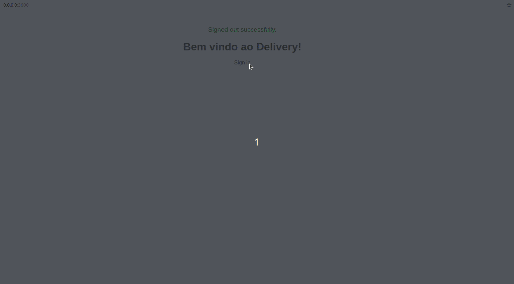

# Aplicação de Delivery

Este repositório representa o backend em Rails para uma aplicação de delivery, incluindo uma interface de gerenciamento de dados para usuários com as roles admin e developer.




## Repositórios Relacionados

- [Consumy Application](https://github.com/SamuelRocha91/consumy) - Aplicação do consumidor
- [Seller Application](https://github.com/SamuelRocha91/seller_application) - Aplicação do vendedor
- [Paymenty API](https://github.com/SamuelRocha91/paymenty) - API de pagamento

### Conceitos e Gems Utilizadas

Este projeto aborda e utiliza os seguintes conceitos e gems:

- **Processos em Background:** Utilização do Sidekiq para processamento assíncrono de tarefas (junto com redis).
- **Paginação:** Implementação de paginação para listagem de recursos (kaminari).
- **Testes com RSpec e Shoulda Matchers:** Testes de unidade e integração utilizando RSpec com Shoulda Matchers para simplificar as asserções.
- **Cobertura de Testes com SimpleCov:** Análise de cobertura de código automatizada com SimpleCov.
- **Soft Delete com Discard:** Implementação de exclusão suave (soft delete) utilizando a gem Discard para manter registros no banco de dados sem excluí-los fisicamente.
- **Anonimização de Dados:** Aplicação de técnicas para anonimização de dados sensíveis.
- **API RESTful:** Desenvolvimento de uma API RESTful para comunicação entre o backend e o frontend.
- **Swagger:** Documentação automática da API com Swagger para facilitar o entendimento e uso.
- **Docker:** Opção de containerização com Docker para facilitar o desenvolvimento e deployment da aplicação.
- **Manipulação de Imagens:** Manipulação de imagens com ferramentas específicas para processamento de mídias.
- **WebSockets e SSE:** Implementação de comunicação em tempo real utilizando WebSockets e Server-Sent Events (SSE) para funcionalidades como chat ou atualizações em tempo real.
- **Cálculo de distância:** Uso da gem geocoder para implementar o cálculo de distância em km do estabelecimento comercial para a residência do cliente.
- **Threads:** Utilização de threads para melhorar a concorrência e o desempenho em operações paralelas.

## Setup do Projeto

### Com Docker

Para executar este projeto utilizando Docker, siga os passos abaixo:

#### Pré-requisitos

Certifique-se de ter o Docker e o Docker Compose instalados em sua máquina.

- [Docker](https://docs.docker.com/get-docker/)
- [Docker Compose](https://docs.docker.com/compose/install/)

#### Configuração

1. Clone os repositórios relacionados:

   ```
   git clone https://github.com/SamuelRocha91/consumy.git
   git clone https://github.com/SamuelRocha91/seller_application.git
   git clone https://github.com/SamuelRocha91/paymenty.git
   git clone https://github.com/SamuelRocha91/delivery_back.git
   ```

2. Baixe o arquivo `docker-compose.yml` para configurar os serviços Docker necessários e insira-o na pasta raiz onde os repositórios foram clonados:

   - [Baixar docker-compose.yml](https://drive.google.com/file/d/1kzs-DJGCvYImBQAqr1GI-zwoNha_b8tA/view?usp=drive_link)

3. Na raiz do projeto, onde está localizado o arquivo `docker-compose.yml`, execute o seguinte comando para construir e iniciar os serviços:

   ```sh
   docker-compose up --build
   ```

4. Ao entrar na aplicação back-end no navegador, clique em "RUN PENDING MIGRATES" para gerar as migrações

5. É recomendável entrar no container da aplicação back-end e rodar as seeds:

  ```sh
   docker exec -it nomeDoContainerBackEnd /bin/sh 
   rails db:seed
   ```

6. É necessário configurar as variáveis de ambiente num arquivo .env dentro da aplicação delivery_back. Ex:

  ```sh
    JWT_SECRET_KEY=xxxxxxxxxxxxxxxxxxxxx
   ```


6. É necessário configurar as variáveis de ambiente num arquivo .env.development dentro da aplicação consumy e seller. Ex:

  ```sh
   VITE_BASE_URL=http://localhost:3000
   VITE_X_API_KEY=Z34dqYJ8qBelcmcBfWNuHc5JB/w=
   ```

**OBS** As api_keys podem ser geradas dentro do container back-end através do console e depois colada no arquivo .env.
**OBS** Outra forma é gerá-la através de um usuário com a role developer dentro da interface do backend e copiar e colar na aplicação devida.
 **OBS** Não esquecer de reiniciar os containers para as variáveis serem carregadas


### Sem Docker

Para configurar e executar o projeto localmente sem Docker, siga os passos abaixo:

#### Pré-requisitos

Certifique-se de ter o Redis e o Sidekiq configurados e executando localmente para o correto funcionamento da aplicação. Além disso, instale as dependências necessárias do R:

```sh
install.packages("FactoMineR")
install.packages("ggplot2")
install.packages("reshape2")
```

#### Instalação das Dependências

```sh
bundle install
```

#### Configurar o Banco de Dados

Crie o banco de dados e execute as migrações:

```sh
rails db:create
rails db:migrate
```

#### Iniciar o Servidor Local

Para iniciar o servidor localmente:

```sh
rails server
```

#### Executar Testes

Para executar os testes automatizados:

```sh
bundle exec rspec
```

#### Iniciar Redis e Sidekiq

Certifique-se de que o Redis está instalado e rodando. Inicie o Redis com o seguinte comando:

```sh
redis-server
```

Em seguida, inicie o Sidekiq:

```sh
bundle exec sidekiq
```

---

Este projeto foi criado como requisito avaliativo para o programa Quero Ser Dev 9ª edição da LWSA.

---
