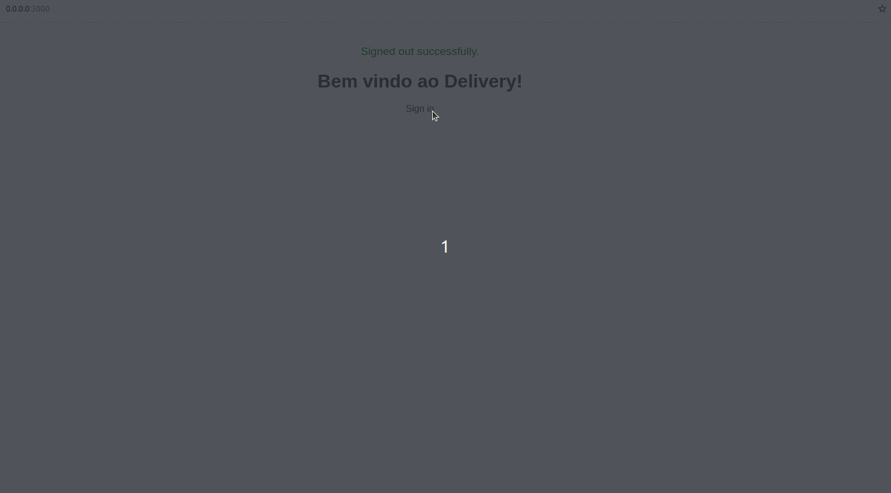

#  Delivery Application 


## 🌐 [](https://github.com/SamuelRocha91/delivery_back/blob/main/README.md) [](https://github.com/SamuelRocha91/delivery_back/blob/main/README_es.md) [](https://github.com/SamuelRocha91/delivery_back/blob/main/README_en.md) [](https://github.com/SamuelRocha91/delivery_back/blob/main/README_ru.md) [](https://github.com/SamuelRocha91/delivery_back/blob/main/README_ch.md) [](https://github.com/SamuelRocha91/delivery_back/blob/main/README_ar.md)

This repository represents the Rails backend for a delivery application, including a data management interface for users with admin and developer roles.



## Related Repositories

- 🛒 [Consumy Application](https://github.com/SamuelRocha91/consumy) - Consumer application
- 👨‍💼 [Seller Application](https://github.com/SamuelRocha91/seller_application) - Seller application
- 💲 [Paymenty API](https://github.com/SamuelRocha91/paymenty) - Payment API

### Concepts and Gems Used

This project covers and utilizes the following concepts and gems:

- **Background Processing**: Use of **Sidekiq** for asynchronous task processing. **Redis** is used as a queue for these tasks, ensuring that long-running operations, such as email sending or data processing, are handled outside the main application cycle, improving performance and user experience.

- **Pagination**: Implementation of pagination for listing resources using the **Kaminari** gem, which makes it easy to handle large volumes of data and enables splitting lists into pages, improving the application’s usability and navigation.

- **Testing with RSpec and Shoulda Matchers**: Use of **RSpec** to write unit, integration, and functional tests. The **Shoulda Matchers** gem simplifies assertions, especially when testing ActiveRecord validations and associations, allowing for a more readable and efficient testing syntax.

- **Test Coverage with SimpleCov**: Integration with **SimpleCov** gem to perform automated code coverage analysis. This ensures that critical areas of the application are covered by tests, providing clear reports on which parts of the code still need coverage.

- **Soft Delete with Discard**: Implementation of soft deletion using the **Discard** gem, which allows records to be "deleted" without being physically removed from the database. This enables future recovery of data and maintains historical integrity.

- **Bullet for N+1 Query Detection**: The **Bullet** gem is used to detect and prevent performance issues such as **N+1 queries**. Bullet alerts the developer when a query could be optimized, suggesting the use of **eager loading** to avoid unnecessary multiple database queries, thus improving application efficiency.

- **Data Anonymization**: Application of techniques to anonymize sensitive data, ensuring compliance with privacy and security regulations such as the **LGPD** (General Data Protection Law). Techniques such as masking and hashing are implemented to protect personal information.

- **RESTful API**: Development of a **RESTful API** that follows software architecture principles to allow efficient communication between the backend and the frontend. The API is designed to be scalable, modular, and easy to maintain.

- **Swagger**: Automatic API documentation using the **Rswag** gem (based on Swagger), which facilitates understanding and usage of the API by providing an interactive interface to test routes, endpoints, parameters, and responses directly in the browser.

- **Docker**: Option for containerization using **Docker**, which simplifies development, testing, and deployment of the application in controlled environments. This ensures that dependencies and infrastructure are isolated and can be easily replicated across different machines.

- **Image Processing**: Use of the **ImageProcessing** gem for image manipulation, such as resizing and compression. Tools like **ruby-vips** are used to optimize large-scale image processing, ensuring high performance.

- **WebSockets and SSE**: Implementation of real-time communication using **WebSockets** for features that require immediate interactivity, such as chats, notifications, or live updates. **Server-Sent Events (SSE)** is another approach used for unidirectional server-to-client updates.

- **Distance Calculation**: Use of the **Geocoder** gem to calculate distances between the client and the business establishment, facilitating location-based services. Distance calculations can be done in kilometers, ensuring precision and efficiency.

- **Threads**: Use of **threads** to improve concurrency and performance in parallel operations, such as processing large amounts of data or integrating with external services. Threads allow multiple operations to be executed simultaneously, optimizing application response time.

- **Session Management and Authentication**: User authentication is handled with **Devise**, a widely used gem in the Rails ecosystem. Support for **JWT** (JSON Web Token) authentication is also provided, especially useful for token-based API authentication.

- **CORS Control**: Use of the **rack-cors** gem to manage **Cross-Origin Resource Sharing (CORS)** permissions, ensuring the API can be accessed securely from different domains.

- **State Machines with State Machines-Activerecord**: Use of the **state_machines-activerecord** gem to implement **state machines** in ActiveRecord models. This allows detailed control over state transitions, ensuring that certain processes or objects follow predefined flows, such as changes in order statuses, payments, or automated processes.

- **Faraday for External API Consumption**: Integration with external services using the **Faraday** gem, an HTTP client library that allows flexible and efficient HTTP/REST requests. This facilitates communication with third-party APIs, offering support for middleware, retries, and error handling.

- **Task Automation and DevOps**: The **DevOps** structure is supported by tools like **Sidekiq** and **Docker** to automate continuous integration, deployment, and background task monitoring.

## Project Setup

### With Docker

To run this project using Docker, follow these steps:

#### Prerequisites

Ensure you have Docker and Docker Compose installed on your machine.

- [Docker](https://docs.docker.com/get-docker/)
- [Docker Compose](https://docs.docker.com/compose/install/)

#### Configuration

1. Clone the related repositories:

   ```sh
   git clone https://github.com/SamuelRocha91/consumy.git
   git clone https://github.com/SamuelRocha91/seller_application.git
   git clone https://github.com/SamuelRocha91/paymenty.git
   git clone https://github.com/SamuelRocha91/delivery_back.git
   ```

2. Download the `docker-compose.yml` file to configure the required Docker services and place it in the root folder where the repositories were cloned:

   - [Download docker-compose.yml](https://drive.google.com/file/d/1kzs-DJGCvYImBQAqr1GI-zwoNha_b8tA/view?usp=drive_link)

3. In the root of the project, where the `docker-compose.yml` file is located, run the following command to build and start the services:

   ```sh
   docker-compose up --build
   ```

4. When accessing the backend application in the browser, click on "RUN PENDING MIGRATES" to generate the migrations.

5. It is recommended to enter the backend application container and run the seeds:

   ```sh
   docker exec -it backendContainerName /bin/sh 
   rails db:seed
   ```

6. You need to configure environment variables in a .env file inside the delivery_back application. Example:

   ```sh
   JWT_SECRET_KEY=xxxxxxxxxxxxxxxxxxxxx
   ```

7. You need to configure environment variables in a .env.development file inside the consumy and seller applications. Example:

   ```sh
   VITE_BASE_URL=http://localhost:3000
   VITE_X_API_KEY=Z34dqYJ8qBelcmcBfWNuHc5JB/w=
   ```

**NOTE** API keys can be generated inside the backend container through the console and then pasted into the .env file.

**NOTE** Another way is to generate them through a user with the developer role inside the backend interface and copy and paste into the appropriate application.

**NOTE** Don't forget to restart the containers for the variables to be loaded.


### Without Docker

To set up and run the project locally without Docker, follow these steps:

#### Prerequisites

Ensure Redis and Sidekiq are configured and running locally for the application to function correctly. Also, install the necessary R dependencies:

```sh
install.packages("FactoMineR")
install.packages("ggplot2")
install.packages("reshape2")
```

#### Installing Dependencies

```sh
bundle install
```

#### Configuring the Database

Create the database and run the migrations:

```sh
rails db:create
rails db:migrate
```

#### Starting the Local Server

To start the server locally:

```sh
rails server
```

#### Running Tests

To run automated tests:

```sh
bundle exec rspec
```

#### Starting Redis and Sidekiq

Ensure Redis is installed and running. Start Redis with the following command:

```sh
redis-server
```

Then, start Sidekiq:

```sh
bundle exec sidekiq
```
## Other projects:

- 📏 [React Precision Application](https://github.com/SamuelRocha91/precisionReactApplication/blob/main/README_en.md) - Interface for registering gas and water measurements
- 🤖 [Node API](https://github.com/SamuelRocha91/apiMeasureWaterAndGas/blob/main/README_en.md) - API for measuring and registering consumption of water and gas
